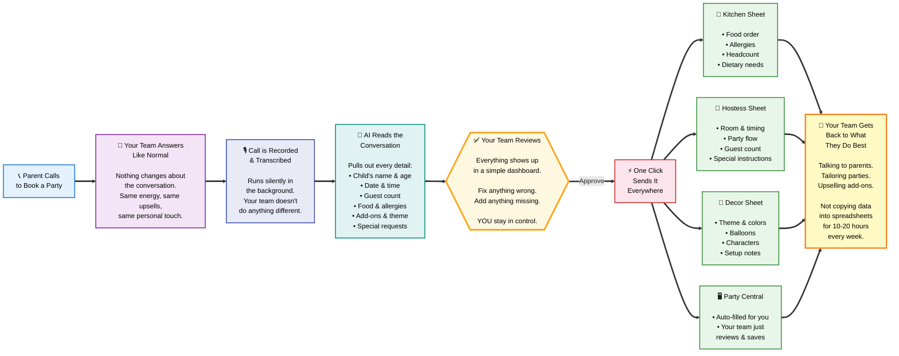

# PartyFlow AI — How It Works for CheekyMonkeys

---

**What changes:** No more copying the same party details into 4 different places. 40-45 parties a weekend, handled with one click each instead of 10-20 hours of data entry.

**What stays the same:** How you talk to parents, how you sell, how you customize every party. Your conversations are your superpower — we just remove the paperwork after.

**Where you stay in control:** You always review everything before it goes anywhere. The AI does the typing — your team does the thinking.
